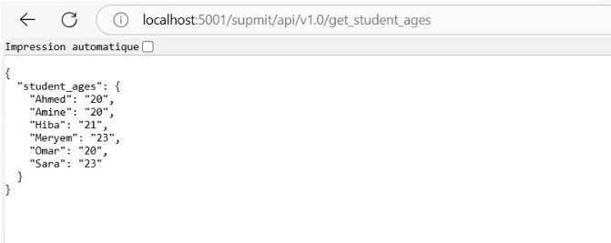

# Mini-Projet Docker : Conteneurisation d'une Application
Ce projet consiste à conteneuriser une application Python avec un frontend en PHP et un backend en Flask. L'application permet d'afficher une liste d'étudiants avec leur âge.
## Structure du Projet
STUDENT_LIST
  data
  simple_api
    Dockerfile
    requirements.txt
    student_age.json
    student_age.py
  website
    apache.conf
    index.php
  config.yml
  docker-compose-registry.yml
  docker-compose.yml
  README.md
## Étapes du Projet
### 1. Construction de l'API

**Dockerfile**

Le fichier `Dockerfile` est utilisé pour construire l'image Docker de l'API Flask. Voici son contenu :

FROM python:3.8-slim
LABEL maintainer="charafi khadija  <charafikhadija2002@example.com>"
RUN mkdir -p /data
COPY student_age.json /data/student_age.json
WORKDIR /app
COPY . .
RUN apt-get update && \
    apt-get install -y gcc libsasl2-dev libldap2-dev libssl-dev && \
    apt-get clean
RUN python3 -m venv /venv
ENV PATH="/venv/bin:$PATH"
RUN pip install --upgrade pip
RUN pip install --no-cache-dir -r requirements.txt
EXPOSE 8000
CMD ["python", "student_age.py"]

explication :

FROM python:3.8-slim:
L'image python:3.8-slim est une version minimale de Python 3.8, ce qui réduit la taille de l'image Docker finale. Elle contient uniquement les packages essentiels pour exécuter Python

LABEL maintainer="charafi khadija  <charafikhadija2002@example.com>"
l'identité de la personne ou de l'équipe qui a créé l'image.

RUN mkdir -p /data
Ce répertoire sera utilisé pour stocker des données persistantes, comme le fichier student_age.json.

COPY student_age.json /data/student_age.json
Copie le fichier student_age.json depuis le répertoire local vers le répertoire /data dans le conteneur

WORKDIR /app
Définit le répertoire de travail dans le conteneur.

COPY . .
Copie tous les fichiers du répertoire local vers le répertoire /app dans le conteneur.
Cela inclut le code source de l'application (student_age.py), le fichier requirements.txt, et tout autre fichier nécessaire.

RUN apt-get update && \ apt-get install -y gcc libsasl2-dev libldap2-dev libssl-dev && \ apt-get clean
Installe les dépendances système nécessaires pour l'application.
    apt-get update: Met à jour la liste des packages disponibles.
    apt-get install -y gcc libsasl2-dev libldap2-dev libssl-dev :Installe les packages suivants :
        Gcc:Compilateur C nécessaire pour certaines dépendances Python
        libsasl2-dev, libldap2-dev, libssl-dev: Bibliothèques nécessaires pour certaines fonctionnalités de l'application 
    apt-get clean:Nettoie le cache des packages pour réduire la taille de l'image

RUN python3 -m venv /venv :
Crée un environnement virtuel Python dans le répertoire /venv/venv permet d'isoler les dépendances Python de l'application du système global, ce qui évite les conflits de versions.

ENV PATH="/venv/bin:$PATH"
Cette ligne ajoute le répertoire /venv/bin au début du PATH, ce qui permet d'utiliser les commandes Python et pip de l'environnement virtuel.

RUN pip install --upgrade pip
Cela garantit que pip pip est à jour avant d'installer les dépendances de l'application.

RUN pip install --no-cache-dir -r requirements.txt
Installe les dépendances Python listées dans  requirements.txt .
    --no-cache-dir: Empêche pip pip de stocker les packages téléchargés dans un cache, ce qui réduit la taille de l'image Docker.

Expose  8000
L'application écoute sur le port 8000. Cette ligne indique à Docker que le conteneur écoutera sur ce port.

CMD ["python", "student_age.py"]
Lorsque le conteneur démarre, il exécute la commande python student_age.py  , ce qui lance l'application Flask.

**Test de l'API:**
    Construisez l'image Docker :
            
    Lancez le conteneur :
            
    Testez l'API avec http://localhost:5000/SUPMIT/api/v1.0/get_student_ages
            
    

### 2.Déploiement avec Docker Compose
docker-compose.yml
Le fichier docker-compose.yml permet de déployer l'application complète (frontend PHP et backend Flask). Voici son contenu :
version: '3'
services:
  api:
    image: student-api
    build: ./simple_api  # Chemin relatif vers le dossier contenant le Dockerfile
    ports:
      - "5001:5000"
    volumes:
      - ./simple_api/student_age.json:/data/student_age.json  # Monte le fichier JSON dans /data du conteneur
    networks:
      - supmit-network

  website:
    image: php:apache
    ports:
      - "8082:80"
    volumes:
      - ./website:/var/www/html  # Monte le dossier "website" local dans /var/www/html du conteneur
    environment:
      - USERNAME=root
      - PASSWORD=root
    depends_on:
      - api
    networks:
      - supmit-network

networks:
  supmit-network:
    driver: bridge
Lancement de l'application
Démarrez l'application avec Docker Compose :
     docker-compose up -d

explication:
Le service api :
    image: student-api : Ici, Docker utilise une image Docker nommée student-api. Si l'image n'existe pas encore, il va la construire avec le code que tu as dans le dossier ./simple_api.
    build: ./simple_api : Cela indique où se trouve le code de l'API, ici dans le dossier simple_api sur ton ordinateur.
    ports: "5001:5000" : Le port 5000 dans le conteneur sera accessible sur le port 5001 de ton ordinateur. Si tu veux accéder à l'API, tu vas aller sur http://localhost:5001.
    volumes: ./simple_api/student_age.json:/data/student_age.json : Cela permet de partager un fichier local (ici student_age.json) avec le conteneur. Le fichier sera accessible dans le conteneur à l'emplacement /data/student_age.json.
    networks: - supmit-network : Cela connecte ce service à un réseau Docker appelé supmit-network (un réseau privé qui permet aux services de communiquer entre eux).

Le service website :

    image: php:apache : Ce service utilise une image Docker avec Apache et PHP. Apache est le serveur web qui va servir ton site, et PHP est le langage utilisé pour générer les pages du site.

    ports: "8082:80" : Le port 80 dans le conteneur (où Apache écoute) sera accessible sur le port 8082 de ton ordinateur. Si tu veux voir ton site, tu iras sur http://localhost:8082.

    volumes: ./website:/var/www/html : Ici, tu montes le dossier website local dans le dossier où Apache cherche les fichiers du site (/var/www/html). Cela signifie que tout fichier dans le dossier website local sera visible par le conteneur.
    environment: - USERNAME=root - PASSWORD=root : Ces lignes définissent des variables d'environnement pour le conteneur. Ici, ce sont des informations comme un nom d'utilisateur et un mot de passe, mais ça pourrait être utilisé pour configurer l'authentification par exemple.
    depends_on: - api : Cela signifie que le service website dépend du service api. Docker s'assurera que l'API est lancée avant de démarrer le site web.
    networks: - supmit-network : Comme pour l'API, ce service est aussi connecté au réseau supmit-network.

Les réseaux :

    supmit-network : Cela crée un réseau Docker privé où tes services api et website peuvent communiquer entre eux. Ils peuvent échanger des informations sans être exposés à l'extérieur.

Accédez à l'interface web via http://localhost/8082 dans votre navigateur.

Cliquez sur le bouton "List Student" pour afficher la liste des étudiants.

### 3. Docker Registry
docker-compose-registry.yml
Pour déployer un registre Docker privé,
version: '3.8'

services:
  registry:
    image: registry:2
    container_name: registry
    ports:
      - "5000:5000"
    volumes:
      - registry_data:/var/lib/registry
    networks:
      - registry_network

  registry-ui:
    image: joxit/docker-registry-ui:latest
    container_name: registry-ui
    ports:
      - "8084:80"
    environment:
      - REGISTRY_TITLE=SUPMIT Private Registry
      - REGISTRY_URL=http://registry:5000  # URL du registre Docker
    depends_on:
      - registry
    networks:
      - registry_network

volumes:
  registry_data:

networks:
  registry_network:
    driver: bridge

explication:
Ce fichier déploie un registre Docker privé et une interface web pour visualiser les images stockées dans le registre.
    Le service registry crée un registre Docker privé auquel tu peux pousser ou tirer des images Docker.
    Le service registry-ui fournit une interface graphique pour interagir avec ce registre.
    Les deux services communiquent via un réseau privé Docker, et les images et données sont stockées de manière persistante grâce au volume registry_data.

Pousser l'image sur le registre
    Taggez les images avec le registre local :
    
    Poussez les images vers le registre :
    
    

test : 
    

## Conclusion
Ce projet a permis de conteneuriser une application Python avec un frontend en PHP et un backend en Flask. L'utilisation de Docker et Docker Compose a simplifié le déploiement et la gestion de l'application. Le registre Docker privé a permis de stocker et de gérer les images Docker de manière sécurisée.